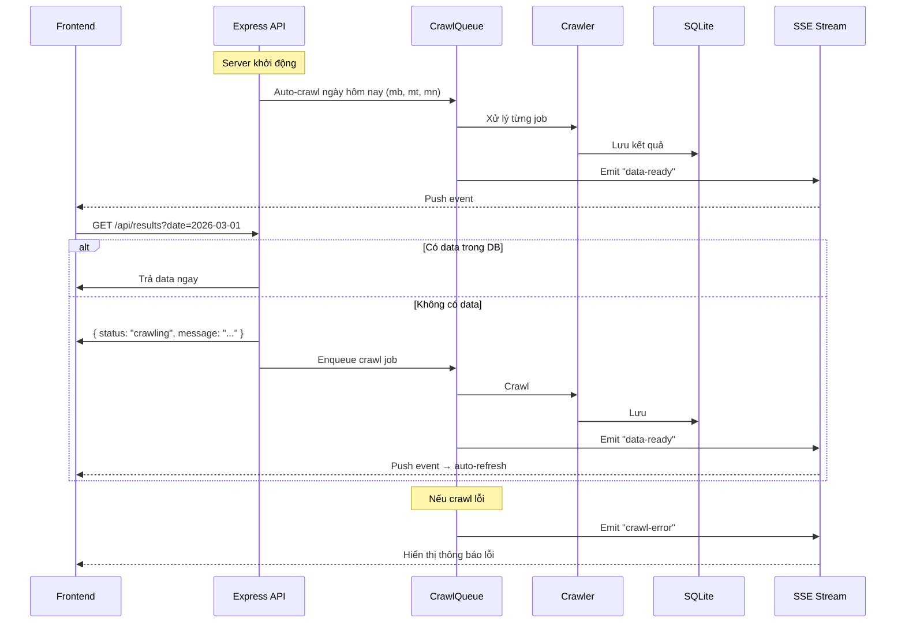

# 📋 Data Improvement Plan — LotoResults

> **Ngày tạo:** 2026-03-01  
> **Trạng thái:** 🔄 Đang triển khai  
> **Nguồn yêu cầu:** [DataImprovement.md](file:///d:/Antigravity/LotoResults/Notes/DataImprovement.md)

---

## 🎯 Tổng quan

Cải thiện hệ thống crawl dữ liệu xổ số: tự động load data khi khởi động, xử lý lỗi crawl tốt hơn, hàng đợi crawl, và thông báo real-time cho Frontend qua **Server-Sent Events (SSE)**.

## 📐 Kiến trúc

## 🏗️ Chi tiết triển khai

### Phase 1: Backend

#### 1.1 CrawlQueue Service (`backend/src/services/crawlQueue.ts`)
- **Singleton queue** với concurrency = 1 (tránh overload nguồn dữ liệu)
- **Job structure:** `{ id, date, region, status, retries, error }`
- **Deduplication:** Không thêm job trùng (cùng date + region + đang pending/processing)
- **Retry:** Tối đa 3 lần, delay tăng dần (1s → 2s → 4s exponential backoff)
- **Rate limiting:** Delay 500ms giữa các job
- **Events:** Emit `data-ready`, `crawl-error`, `queue-status` qua EventEmitter

#### 1.2 SSE Service (`backend/src/services/sseManager.ts`)
- Quản lý danh sách connected clients
- Broadcast events đến tất cả clients
- Heartbeat mỗi 30s để giữ connection
- Auto-cleanup khi client disconnect

#### 1.3 SSE Route (`GET /api/events`)
- Content-Type: `text/event-stream`
- Events: `data-ready`, `crawl-error`, `crawl-progress`

#### 1.4 Auto-crawl on Startup
- Sau khi DB init xong, chạy crawl cho ngày hôm nay (cả 3 miền)
- Chạy async, không block server startup

#### 1.5 Cải thiện API `/api/results`
- Khi không có data → respond ngay + enqueue crawl
- Response mới: `{ success: true, data: [], meta: { status: "crawling" } }`

### Phase 2: Frontend

#### 2.1 SSE Hook (`frontend/src/hooks/useServerEvents.ts`)
- Custom hook kết nối SSE endpoint
- Auto-reconnect khi mất kết nối
- Parse và dispatch events

#### 2.2 Toast Notification Component (`frontend/src/components/Toast.tsx`)
- Hiển thị thông báo real-time
- Tự ẩn sau 5 giây
- Màu sắc theo loại (success/error/info)

#### 2.3 Auto-refresh trên SearchPage
- Khi nhận `data-ready` event → invalidate React Query cache
- UI tự cập nhật mà không cần reload

---

## ✅ Checklist

### Phase 1 — Backend
- [ ] `backend/src/services/crawlQueue.ts` — CrawlQueue service
- [ ] `backend/src/services/sseManager.ts` — SSE manager
- [ ] [backend/src/routes/api.ts](file:///d:/Antigravity/LotoResults/backend/src/routes/api.ts) — Thêm SSE endpoint + cải thiện `/results`
- [ ] [backend/src/index.ts](file:///d:/Antigravity/LotoResults/backend/src/index.ts) — Auto-crawl on startup
- [ ] Verify: backend build & lint pass

### Phase 2 — Frontend 
- [ ] `frontend/src/hooks/useServerEvents.ts` — SSE hook
- [ ] `frontend/src/components/Toast.tsx` — Toast notification
- [ ] [frontend/src/App.tsx](file:///d:/Antigravity/LotoResults/frontend/src/App.tsx) — Integrate SSE + Toast
- [ ] [frontend/src/pages/SearchPage.tsx](file:///d:/Antigravity/LotoResults/frontend/src/pages/SearchPage.tsx) — Auto-refresh on data-ready
- [ ] Verify: frontend lint & build pass

### Phase 3 — Documentation
- [ ] Báo cáo vào `Reports/`
